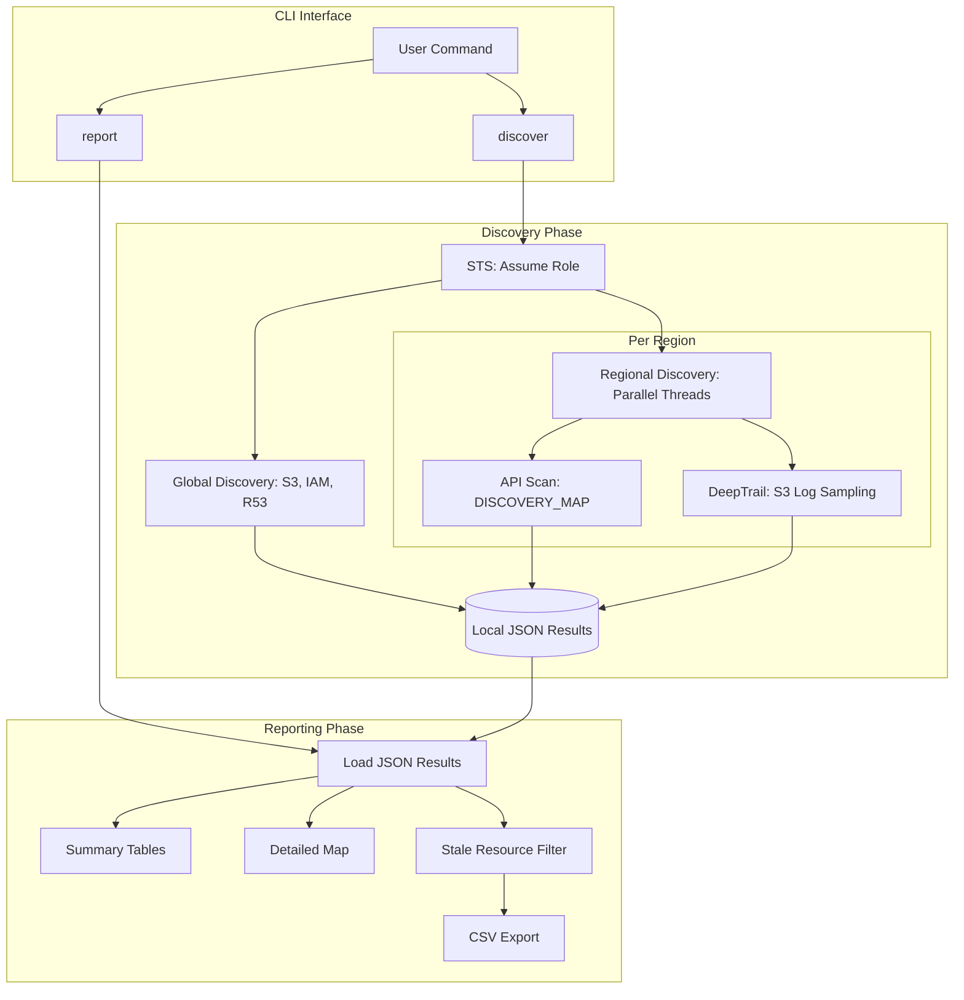

# Wolkfind Architecture

Wolkfind is a modular AWS discovery tool designed for high-performance resource auditing across multiple accounts and regions. It emphasizes "activity-first" discovery by combining static infrastructure scans with CloudTrail log analysis.

## Core Components

The tool is organized into several specialized modules within the `wolkfind/` package:

### 1. Orchestration (`aws_discovery.py`)
- **CLI Entry Point**: Uses `click` to handle user commands (`discover`, `report`).
- **Session Management**: Manages `boto3.Session` initialization and AWS Role Assumption (STS).
- **Concurrency**: Orchestrates regional discovery using a `ThreadPoolExecutor` for parallel execution.
- **Persistence**: Implements the standardized JSON writing logic.

### 2. Configuration (`discovery_config.py`)
- **Service Maps**: Centralized definition of which services to scan and which API operations to call.
- **Resource Mapping**: Defines the relationship between filenames, API methods, and JSON result keys.
- **Constants**: Global settings like `DEFAULT_MAX_WORKERS` and `LOOKUP_DAYS`.

### 3. Global Discovery (`discovery_global.py`)
- Focuses on non-regional AWS services: **S3**, **IAM**, and **Route53**.
- Collects global identities and storage assets that provide context for regional scans.

### 4. Regional Discovery (`discovery_regional.py`)
- Iterates through the `DISCOVERY_MAP` for a specific region.
- Performs automated pagination and error handling for regional resources (EC2, RDS, VPC, etc.).
- Integrates with the `DeepTrail` module to perform activity analysis.

### 5. DeepTrail Analysis (`deeptrail.py`)
- **Sparse Sampling**: Downloads a small subset of CloudTrail logs from S3 archives to minimize cost and time.
- **Active Service Detection**: Identifies services being used in the account that are not explicitly mapped in the tool's static scan.
- **Temporal Insight**: Provides "Last Active" context for discovered resources.

### 6. Reporting Engine (`report.py`)
- **Aggregation**: Reads the hierarchical JSON result structure.
- **Multi-Account Support**: Consolidates results from multiple account IDs into a single reporting session.
- **Stale Resource Detection**: Filters resources older than 90 days.
- **Outputs**:
    - **Summary Tables**: Categorized regional counts (Compute, Data, Network, etc.).
    - **Detailed Map**: A tree view showing specific resource IDs and creation dates.
    - **CSV Export**: A flat list of stale resources for external auditing.

## Data Flow & Storage

Wolkfind follows a "Capture-then-Report" pattern. 

1. **Discovery Phase**:
   - AWS API -> `wolkfind` -> Local JSON.
   - Files are stored in: `wolkfind/results/<account_id>/<region_or_global>/<service>/<resource>.json`.

2. **Reporting Phase**:
   - Local JSON -> `wolkfind` -> Rich Console Output / CSV.

## Design Principles

- **Read-Only**: The tool strictly uses `Describe*`, `List*`, and `Get*` operations. It never modifies AWS state.
- **Resilience**: API failures (like `AccessDenied`) are caught at the operation level, allowing the scan to continue for other services.
- **Account Isolation**: Data is strictly organized by Account ID to prevent cross-contamination during multi-account audits.
- **Zero-Install Execution**: All dependencies and metadata are defined such that the tool can be run via `uv run` without a manual virtual environment setup.
